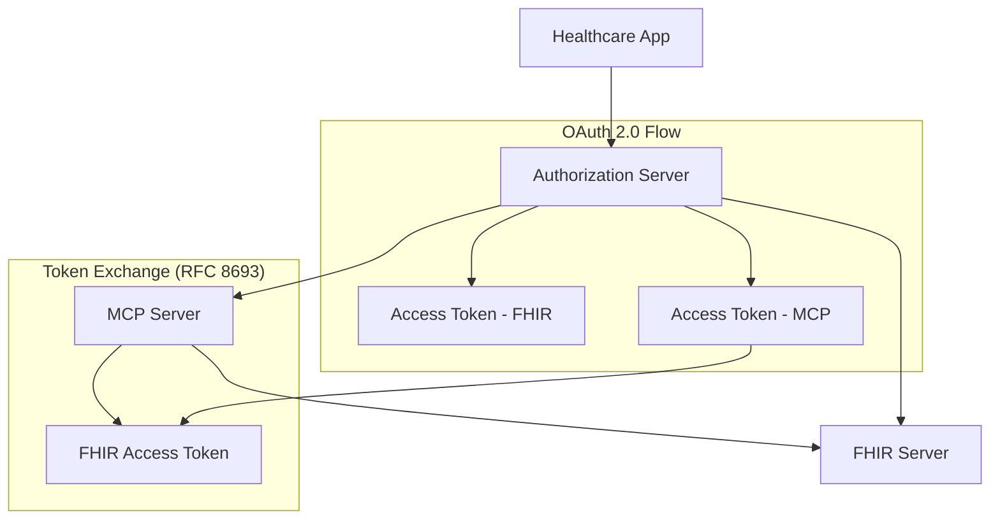

# FHIR-MCP Authorization Demo

[](https://github.com/durvester/FHIR-MCP-react-UI/actions/workflows/deploy.yml)
[](https://opensource.org/licenses/MIT)

> **🚀 [Live Demo](https://durvester.github.io/FHIR-MCP-react-UI/)**

An interactive React application demonstrating unified OAuth 2.0 authorization flows for healthcare applications that need to access both FHIR (Fast Healthcare Interoperability Resources) and MCP (Model Context Protocol) AI tools.


## 🎯 Purpose

This demo showcases how modern healthcare applications can implement a unified authorization architecture that supports:
- Traditional FHIR API access for clinical data
- AI-powered MCP tools for enhanced clinical decision support
- Seamless token exchange between services using RFC 8693

## ✨ Features

### 🔐 OAuth 2.0 & SMART on FHIR
- **Client Registration**: Simulate OAuth 2.0 app registration
- **Discovery Process**: SMART on FHIR capability discovery
- **Authorization Code Flow**: Complete OAuth flow with scope selection
- **Token Management**: JWT token handling and validation

### 🏥 FHIR Integration
- **Patient Demographics**: US Core compliant patient data
- **Clinical Observations**: Vital signs and lab results
- **API Testing**: Interactive FHIR endpoint testing
- **Real-time Responses**: Mock FHIR server responses

### 🤖 MCP AI Tools
- **Patient Summarization**: AI-powered clinical summaries
- **Vitals Analysis**: Intelligent vital signs interpretation
- **Token Exchange**: Transparent RFC 8693 token exchange
- **Unified Authorization**: Same auth server for FHIR and MCP

## 🚀 Quick Start

### Prerequisites
- Node.js 18+ 
- npm or yarn

### Installation

```bash
# Clone the repository
git clone https://github.com/durvester/FHIR-MCP-react-UI.git
cd FHIR-MCP-react-UI

# Install dependencies
npm install

# Start development server
npm run dev
```

The application will be available at `http://localhost:3000`

### Demo Credentials

Use these credentials to test the authorization flow:

```
Username: dr.smith@hospital.com
Password: demo123
FHIR Base URL: https://fhir.ehr-company.com
```

## 📖 Usage Guide

### 1. App Registration
- Click "Register Healthcare App" to create OAuth 2.0 client credentials
- Note the generated Client ID and Client Secret

### 2. Discovery
- Enter the FHIR Base URL: `https://fhir.ehr-company.com`
- Click "Discover" to retrieve SMART on FHIR configuration

### 3. Authorization
- **FHIR Authorization**: Authorize access to clinical data
- **MCP Authorization**: Authorize access to AI tools
- Select appropriate scopes for each resource type

### 4. API Testing
- **FHIR API**: Test patient data retrieval
- **MCP Tools**: Execute AI-powered clinical analysis

## 🏗️ Architecture



## 🛠️ Development

### Project Structure

```
├── src/
│   └── main.jsx          # Application entry point
├── mcp-fhir.jsx          # Main demo component
├── index.html            # HTML template
├── vite.config.js        # Vite configuration
└── .github/
    └── workflows/
        └── deploy.yml     # GitHub Pages deployment
```

### Available Scripts

```bash
npm run dev      # Start development server
npm run build    # Build for production
npm run preview  # Preview production build
```

### Technology Stack

- **Frontend**: React 18, Vite
- **Styling**: Tailwind CSS
- **Icons**: Lucide React
- **Deployment**: GitHub Pages
- **CI/CD**: GitHub Actions

## 🚀 Deployment

### GitHub Pages (Recommended)

This repository is configured for automatic deployment to GitHub Pages:

1. Fork this repository
2. Go to Settings → Pages
3. Set Source to "GitHub Actions"
4. Push to main branch to trigger deployment

### Other Platforms

The built application (`npm run build`) can be deployed to any static hosting service:
- Netlify
- Vercel
- AWS S3 + CloudFront
- Azure Static Web Apps

## 🔧 Configuration

### Environment Variables

For production deployments, you may want to configure:

```bash
# Vite environment variables
VITE_FHIR_BASE_URL=https://your-fhir-server.com
VITE_MCP_BASE_URL=https://your-mcp-server.com
VITE_AUTH_BASE_URL=https://your-auth-server.com
```

### Customization

Key areas for customization:

- **FHIR Data**: Update `HARDCODED_PATIENT` object in `mcp-fhir.jsx`
- **Scopes**: Modify `SMART_SCOPES` for your use case
- **Styling**: Customize Tailwind classes or add custom CSS
- **Endpoints**: Update base URLs for your servers

## 🤝 Contributing

Contributions are welcome! Please feel free to submit a Pull Request.

### Development Guidelines

1. Fork the repository
2. Create a feature branch (`git checkout -b feature/amazing-feature`)
3. Commit your changes (`git commit -m 'Add amazing feature'`)
4. Push to the branch (`git push origin feature/amazing-feature`)
5. Open a Pull Request

## 📚 Resources

### FHIR & SMART on FHIR
- [FHIR R4 Specification](https://hl7.org/fhir/R4/)
- [SMART App Launch](https://hl7.org/fhir/smart-app-launch/)
- [US Core Implementation Guide](https://hl7.org/fhir/us/core/)

### OAuth 2.0 & Security
- [RFC 6749 - OAuth 2.0](https://tools.ietf.org/html/rfc6749)
- [RFC 8693 - Token Exchange](https://tools.ietf.org/html/rfc8693)
- [OAuth 2.0 Security Best Practices](https://tools.ietf.org/html/draft-ietf-oauth-security-topics)

### Model Context Protocol
- [MCP Specification](https://modelcontextprotocol.io/)
- [MCP Implementation Guide](https://modelcontextprotocol.io/docs/)

## 📄 License

This project is licensed under the MIT License - see the [LICENSE](LICENSE) file for details.

## 🙏 Acknowledgments

- Built with [React](https://reactjs.org/) and [Vite](https://vitejs.dev/)
- Icons by [Lucide](https://lucide.dev/)
- Styling with [Tailwind CSS](https://tailwindcss.com/)
- Patient data based on [Synthea](https://synthetichealth.github.io/synthea/) synthetic data
- FHIR test data compliant with [Inferno](https://inferno-framework.github.io/) test suite

---

**Made with ❤️ for the healthcare developer community**